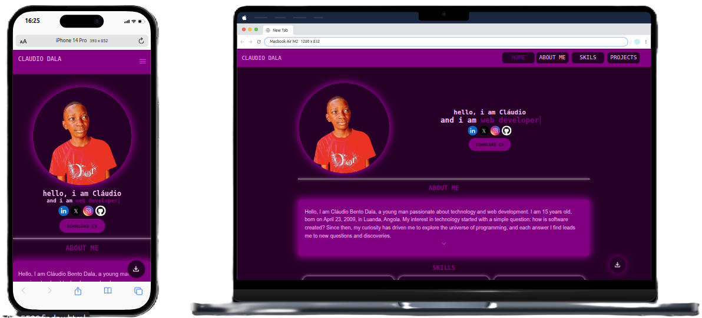

# 🌐 Claudio Dala's Portfolio

Welcome to my portfolio! Here you will find the main projects I’ve developed, showcasing my skills in web development, programming, and interface design.

## 📁 About

This repository contains my personal portfolio hosted on **GitHub Pages**, with an organized presentation of my projects, mastered technologies, and professional contact options.

## 💻 Technologies Used

- **HTML5**
- **CSS3**
- **JavaScript**
- **Git & GitHub**
- **Responsive Design (Mobile First)**

## 🧩 Features

- Professional presentation
- Project gallery with links
- Technical skills section
- Contact via email and social networks
- Responsive and accessible design

## 🔗 Visit the Portfolio

📍 [Click here to view my online portfolio](https://claudiobentodaladev.github.io/PORTFOLIO/)

## 📷 Screenshot

## 📌 Purpose

This portfolio aims to showcase my skills to recruiters, clients, or project partners.

## 📬 Contact

- **Email:** programmer.claudio@gmail.com
- **LinkedIn:** [linkedin.com/in/claudiodala/](https://www.linkedin.com/in/claudiodala/)  
- **GitHub:** [github.com/claudiobentodaladev](https://github.com/claudiobentodaladev)

## 🛠️ In Development

I’m continuously updating this portfolio with new projects, visual improvements, and interactive features.

---

### Thanks for visiting! 🚀